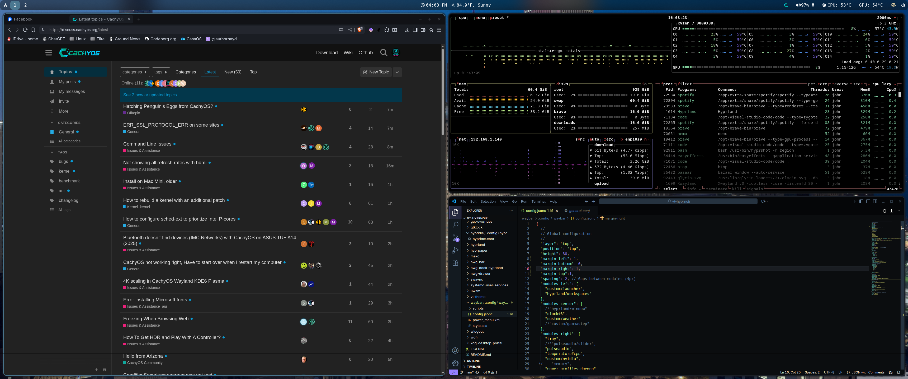

# Hyprland Dotfiles 
[](https://ko-fi.com/J3J01HKVYF)

These are my personal dotfiles for [Hyprland](https://github.com/hyprwm/Hyprland), focused on performance, clean startup, and a visually cohesive dark aesthetic.

## ✨ What's Included

### 🔧 Systemd User Services

The following components are managed via `systemd --user` for reliable session-based startup and restart:

- **Waybar** – status bar
- **SwayNC** – notification daemon
- **Hypridle** – idle manager (triggers lock and suspend)
- **Hyprpaper** – wallpaper daemon
- **nwg-dock** – dock/panel for quick access

All services use the following structure for proper Hyprland session integration:

```ini
ConditionEnvironment=HYPRLAND_INSTANCE_SIGNATURE
After=graphical-session.target
PartOf=graphical-session.target
```

They auto-start with the Hyprland session and terminate cleanly on logout.

---

## 🎨 Style & Theme

All visual styles are based on the [Dracula color palette](https://draculatheme.com/), applied consistently across components:

- **GTK Theme**: Andromeda (dark)
- **Waybar**: Custom `style.css` themed with Dark colors
- **SwayNC**: Styled with matching accents
- **Hyprpaper**: Uses a dark-themed 3440x1440 wallpaper
- **Font**: JetBrains Mono
- **Icons**: Obsidan Grey

> The result is a seamless, modern, and dark aesthetic across all UI elements.

---
📸 Screenshots

Here are example screenshots of the setup:




---

## 🚀 Getting Started

### 1. Clone and Stow

```bash
git clone git@github.com:yourusername/hyprland-dotfiles.git
cd hyprland-dotfiles
stow .
```

### 2. Reload and Restart User Services

```bash
systemctl --user daemon-reexec
systemctl --user daemon-reload
systemctl --user restart waybar.service swaync.service hypridle.service hyprpaper.service nwg-dock.service
```

---

## 🧩 Optional Tools

- [Hyprlock](https://wiki.hyprland.org/Useful-Utilities/Hyprlock/) – screen locker (disabled by default)
- [Mako](https://github.com/emersion/mako) – lightweight alternative to SwayNC

---

---

## 🔒 Contribution Policy

This repository is **read-only**.

You are welcome to copy, fork, and adapt these dotfiles for your own use, but **merge requests, pull requests, or changes will not be accepted**. This is a personal config archive, not a collaborative project.

---


## 📜 License

This project is licensed under the [MIT License](https://opensource.org/licenses/MIT). You are free to use, copy, modify, merge, publish, distribute, and/or sublicense the contents.

